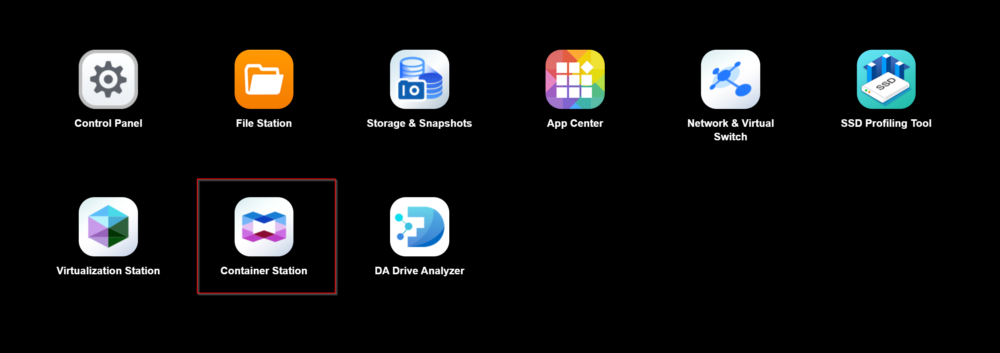
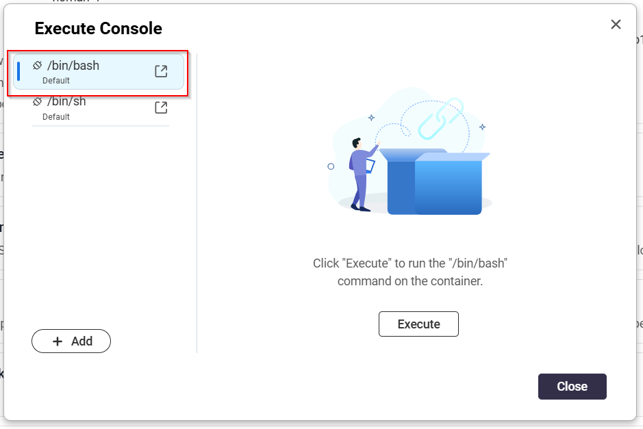
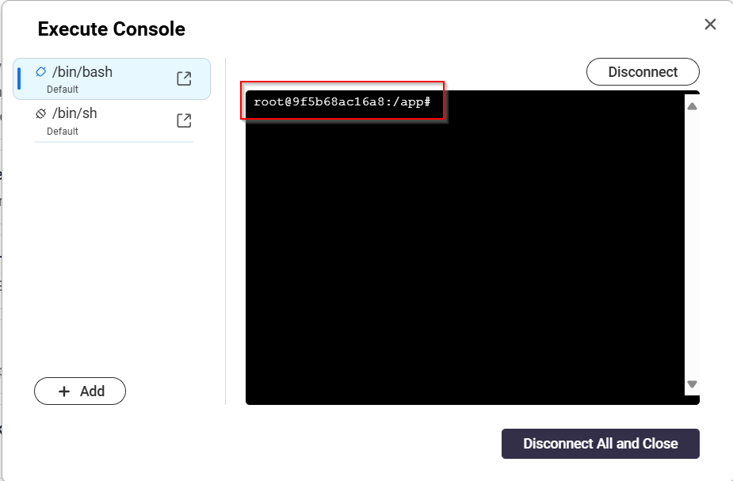

# Command line interface

The Muninn image ships with a built-in recovery tool. This can be useful, if you do not have access to Muninn or if something is not working.
Please note that the CLI is an *emergency tool*, not an API tool.

:::caution

Using the recovery CLi tool can cause problems when requests are being sent to Muninn while the tool is running. \
You should also create a backup of the database, in case you break something.

:::

## Execute CLI with Docker

1. Execute ``docker ps | grep muninn`` on the root system with Docker to find the container ID of your Muninn container.
2. Run ``docker exec -it <container-id> /bin/bash muninn <your-command-goes-here>``. \
Replace ``<container-id>`` with your container ID from step 1. \
Replace ``<your-command-goes-here>`` with the command you want to execute (see sub-pages).

## Execute CLI with QNAP

1. Open Container Station in the QNAP Web Interface 
2. Select Containers in the menu bar on the left
3. Select your Muninn Container
4. Click "Execute" in the top right of the Window.
5. Select /bin/bash and click Execute 
6. Run the Muninn command and press enter (eg. muninn reset-owner-password) 
